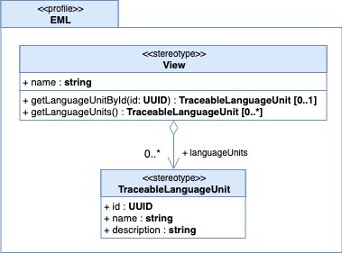

# Introduction

This specification defines the Event Modeling Language ("EML"). The principle objective of EML is to provide a ubiqutous language for describing large event driven solutions making it easier for analyts, architects, and developers to work and collaborate together.

By adopting a common language, and with the support of relevant tooling, modelers will have the capability to fully describe and discover events not only within their own jurisdiction, but also across those that are external to it. A common language will make event driven applications and services easier to design, deploy, and evolve by augmenting the more traditional development lifecycle activities.

## Scope

The EML is designed to be a highly visual language and this _superstructure_ specification aims to describe this language. Without this specification the EML would remain completely non-normative and open to interpretation.

The EML specification will be described using the Unified Modeling Language ("UML"), and to assist, the following UML profile will be used to define the top most elements:

### Language Units

The concepts represented by the EML are grouped into _language units_. Each language unit describes the tightly coupled modeling concepts that provide EML modelers the capability to represent and describe an aspect of an event driven solution using a particular formalism. For example, the _Domains_ language unit enables a modeler to reason about the jurisdiction and ownership of events, while the _Functions_ language unit considers the behavioural nature of producing and consuming events.

### Views

EML organizes _language units_ into a series of _views_ where each view focuses on a different level of refinement for the language units. The principle aim of each view is to more directly support the needs of the modeler based on their knowledge and specialties without removing any collaborative effort from the lifecycle activities.

With regards to refinement, a core requirement of the EML is to preserve traceability of a language unit as it is refined through each of the views. The EML uses the following views (presented in the order of their level of refinement):

- *Conceptual*: Allows modelers to think about their domains, events, and functions free of any runtime aspects.   

- *Logical*: Elaborates domains into channels, identifying keys or partitions of interest. Also brings together how our _local_ domains might interact with the domains that are beyond our own jurisdiction.  

- *Process*: Functions are further brought together as groups allowing them to be organized into services and applications that are then ready for deployment.

The remainder of this specification will describe the EML formalisms using a top-down approach and fully describe each view along with how it refines the language units within it. Consequently, we will describe the elements of the EML as they are refined from a concept to a potentially deployable asset.