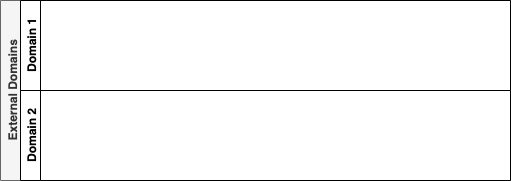

### ExternalDomain

An `ExternalDomain` defines a logical boundary of applicability for events that are external and outside of our own jurisdiction.

#### Attributes

Inherits attributes from `Domain`. No further attributes are defined.

#### Associations

Inherits associations from `Domain`. No further associations are defined.

#### Constraints

No constraints.

#### Semantics

An `ExternalDomain` represents a _reference_ to a _sub-domain_ that describes events outside of our own control that we are intending to integrate with. External domains do not reveal any details regarding units of behaviour, because in event driven systems we integrate by producing and consuming events.

#### Notation

Each external domain is represented as a swim-lane stacked vertically in a container designated "External Domains".

