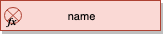

### Function

Represents a unit of behaviour that is invoked in order to respond to an originating event. The side effect of an invoked function may include the realization of further events, ultimately leading to a cascade of behaviour in the local domain and possibly external to it.

#### Attributes

Inherits attributes from `DomainUnit`. No further attributes are defined.

#### Associations

Inherits associations from `DomainUnit`. No further associations are defined.

#### Constraints

**(1)** Functions cannot be a realization of an originating function.

```ocl
context Function
  inv: self.realizations->select(unit | unit.oclIsTypeOf(Function))->size = 0
       and self.originations->select(unit | unit.oclIsTypeOf(Function))->size = 0
```

Functions can only influence other units of behaviour by raising further events.

#### Semantics

There are no specific semantics associated with the conceptual view of a function. It is a placeholder for further refinement in the logical view.

#### Notation

A function is drawn within the boundary of its containing `Domain` as a rectangular box displaying the `TraceableLanguageUnit::name` property.


