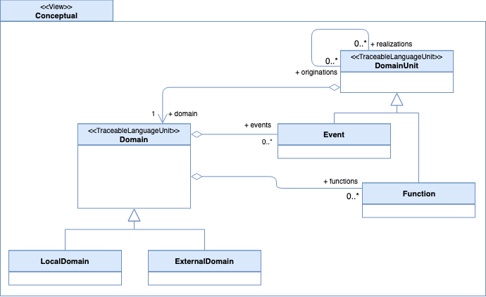

# The Conceptual View

## Overview

The EML conceptual view allows modelers to reason about events, units of behaviour, and their jurisdiction within a collection of domains free of any details about their implementation. A conceptual view is used to understand the broadest aspects of an event driven system.

One important property of the conceptual view is that the elements it defines may have a longer lifetime than the further refined elements described in the other EML views. The need for events that are centered around a core business activity for example, may exist forever, while their implementation may change over time.

## Model

