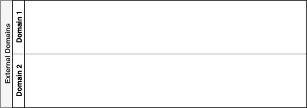

# The Conceptual View

## Overview

The EML conceptual view allows modelers to reason about events, units of behaviour, and their jurisdiction within a collection of domains free of any details about their implementation. A conceptual view is used to understand the broadest aspects of systems built using event driven approaches.

One important property of the conceptual view is that the elements it defines may have a longer lifetime than the further refined elements described in the other EML views. The need for events that are centered around a core business activity for example, may exist forever, while their implementation may change over time.

## Model


## Class Descriptions

### Domain

A `Domain` defines a tangible and logical boundary of applicability within an event driven software system.

#### Attributes

Inherits attributes from `TraceableLanguageUnit`. No further attributes are defined.

#### Associations

- `events` : `Event` [0..*]  
The events that are applicable within the associated domain.

- `functions` : `Function` [0..*]  
Represents notional units of behaviour that are relevant within the associated domain.

#### Constraints

No constraints.

#### Semantics

With Domain Driven Design ("DDD") as context, we can consider a _domain_ as representing something in the _problem_ space that is to be addressed with a software effort. Furthermore, domains can be decompossed into sub-domains which typically reflect some organizational structure and scope. It is at this level that an EML `Domain` would operate.

Decomposition, especially in an enterprise setting, is important because modeling large domains gets progressively harder when working within a single model. DDD recognizes that a single unified model of an entire business is not feasible or even cost effective, and so introduces decomposition through _sub-domains_ and _bounded contexts_. Each sub-domain can have its own unified model and describe both unrelated or local concepts, alongside shared or common concepts with mechanisms to map between them for integration purposes.

The EML approaches decomposition by allowing domains to be decomposed into multiple _local_ domains that describe local events of interest, and by supporting references to _external_ domains that provide integration with shared or common events that fulfill an overall business need.

In a supporting EML Logical View, a conceptual local domain can be refined into one or more channels which is akin to a _bounded context_. Ultimately, a sub-domain (or EML `LocalDomain`) aims to delimit the applicability of a broader business domain, while a bounded context (or EML `Channel`) delimits the applicability of the sub-domain. Domains are defined within the problem space, while bounded contexts operate within the solution space.

#### Notation

`Domain` is an abstract concept that has a visual notation that is defined by `LocalDomain` and `ExternalDomain`.

### LocalDomain

A `LocalDomain` defines a logical boundary of applicability with regards to the events and units of behaviour that are relevant to our own local concepts. These local concepts are typically within our own jurisdiction.

#### Attributes

Inherits attributes from `Domain`. No further attributes are defined.

#### Associations

Inherits associations from `Domain`. No further associations are defined.

#### Constraints

No constraints.

#### Semantics

A `LocalDomain` represents a _sub-domain_ that describes local events and units of behaviour.

#### Notation

Each local domain is represented as a swim-lane stacked vertically in a container designated "Local Domains".


### ExternalDomain

An `ExternalDomain` defines a logical boundary of applicability for events that are external and outside of our own jurisdiction.

#### Attributes

Inherits attributes from `Domain`. No further attributes are defined.

#### Associations

Inherits associations from `Domain`. No further associations are defined.

#### Constraints

No constraints.

#### Semantics

An `ExternalDomain` represents a _reference_ to a _sub-domain_ that describes events outside of our own control that we are intending to integrate with. External domains do not reveal any details regarding units of behaviour, because in event driven systems we integrate by producing and consuming events.

#### Notation

Each external domain is represented as a swim-lane stacked vertically in a container designated "External Domains".



### DomainUnit

Defines the local concepts associated with a given domain. In the EML conceptual view, these units specialize as events and functions.

#### Attributes

Inherits attributes from `TraceableLanguageUnit`. No further attributes are defined.

#### Associations

- `originations` : `DomainUnit` [0..*]  
The sources of the current domain unit. For example, an event may be the side effect of an invoked function so it will have an origination from that function.

- `realizations` : `DomainUnit` [0..*]  
Represents the domain units that are caused by the current domain unit. For example, a function may yield futher events as a side effect of its invocation.

#### Constraints

No constraints.

#### Semantics

TODO

#### Notation

TODO

### Function

TODO

#### Attributes

Inherits attributes from `DomainUnit`. No further attributes are defined.

#### Associations

Inherits associations from `DomainUnit`. No further associations are defined.

#### Constraints

**(1)** Functions cannot be a realization of an originating function.

```ocl
context Function
  inv: self.realizations->select(unit | unit.oclIsTypeOf(Function))->size = 0
       and self.originations->select(unit | unit.oclIsTypeOf(Function))->size = 0
```

Functions can only influence other units of behaviour by raising further events.

#### Semantics

TODO

#### Notation

TODO

### Event

TODO

#### Attributes

Inherits attributes from `DomainUnit`. No further attributes are defined.

#### Associations

Inherits associations from `DomainUnit`. No further associations are defined.

#### Constraints

**(1)** Events cannot be a realization of an originating event in their own domain.

```ocl
context Event
  inv: self.realizations->select(unit | unit.oclIsTypeOf(Event))
         ->forAll(e | e.domain <> self.domain)
       and self.originations->select(unit | unit.oclIsTypeOf(Event))
         ->forAll(e | e.domain <> self.domain)
```

While it is obvious that we want causal connections between events in an event driven system, when considering events that occur within the same domain we want the cause of an event to be driven by some unit of behaviour. 

#### Semantics

TODO

#### Notation

TODO
